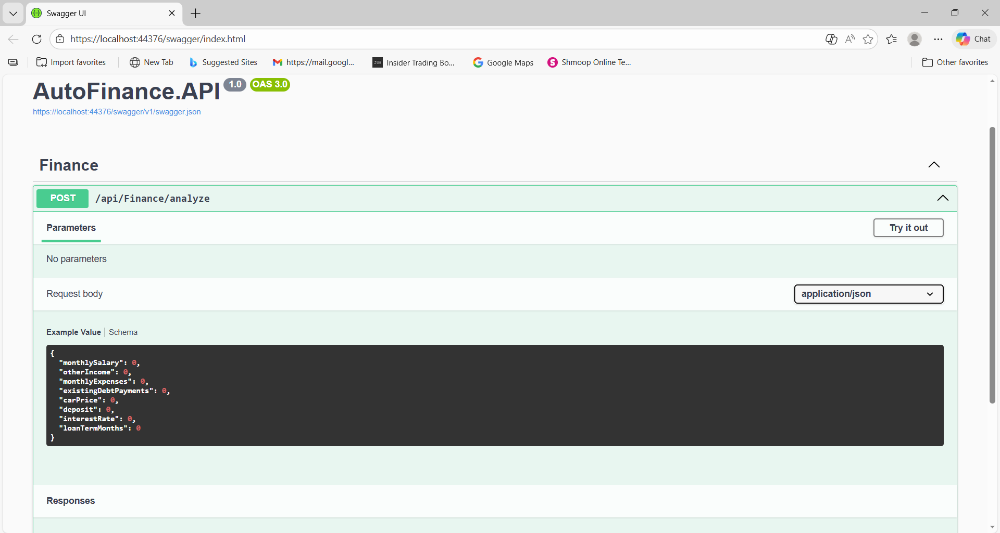
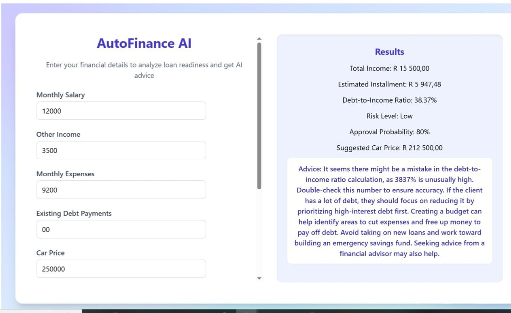

🚗 AutoFinance AI
A full-stack AI-powered car finance analysis application built to demonstrate backend engineering, financial logic, API architecture, and frontend integration.

==========

🌍 Live Demo
Frontend:
https://autofinance-frontend.vercel.app⁠

Backend API (Swagger):
https://autofinanceapi-e2g3a5hwbaergyg6.southafricanorth-01.azurewebsites.net

==========

🧠 What This Project Demonstrates

As a Junior AI Engineer / Developer, this project showcases:

-Designing and building a RESTful API using ASP.NET Core
-Implementing real-world financial algorithms (loan & DTI calculations)
-Risk scoring and approval probability logic
-AI-generated financial advice integration
-Clean layered backend architecture (Models → Services → Controllers)
-Cloud deployment (Azure App Service + Vercel)
-Full frontend-to-backend integration

==========

⚙️ Core Features

-Monthly loan installment calculation
-Debt-to-Income (DTI) ratio analysis
-Risk level classification
-Approval likelihood estimation
-Safer car price suggestion
-AI-powered financial recommendations
-Swagger documentation for API testing

==========

🏗 Architecture

Backend follows clean separation of concerns:
> Models – Request & response contracts
< Services – Business logic & financial calculations
< Controllers – API endpoints
< Dependency Injection – Clean service registration

This structure ensures scalability and maintainability.

==========

🛠 Tech Stack

 Backend
- C#
- ASP.NET Core Web API
- Swagger
- Azure App Service
  
Frontend
- React (Vite)
- Tailwind CSS
- Axios for API communication
  
Cloud
- Azure (Backend hosting)
- Vercel (Frontend hosting)

  ==========
  
📂 Project Structure

AutoFinance.API/              → ASP.NET Core backend
autofinanceapi-frontend/     → React frontend
docs/                         → Screenshots & documentation
AutoFinance.slnx              → Visual Studio solution

==========

🚀 Running Locally

Backend
---
bash
cd AutoFinance.API
dotnet run
Swagger runs at:
https://localhost:44376/swagger

Frontend
powershell
cd autofinanceapi-frontend-vite
npm run dev
Frontend runs at:
http://localhost:5173

==========

## Screenshots

**Backend — Swagger UI:**  

**Frontend:**  

==========

👨‍💻 About Me

I am a Junior AI Engineer focused on:
- Backend API development
- AI integration
- Applied financial logic
- Cloud deployment
- Full-stack engineering fundamentals
- 
This project reflects my ability to design, build, deploy, and integrate a complete AI-enabled system.
